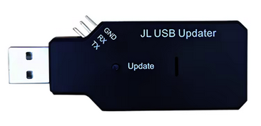
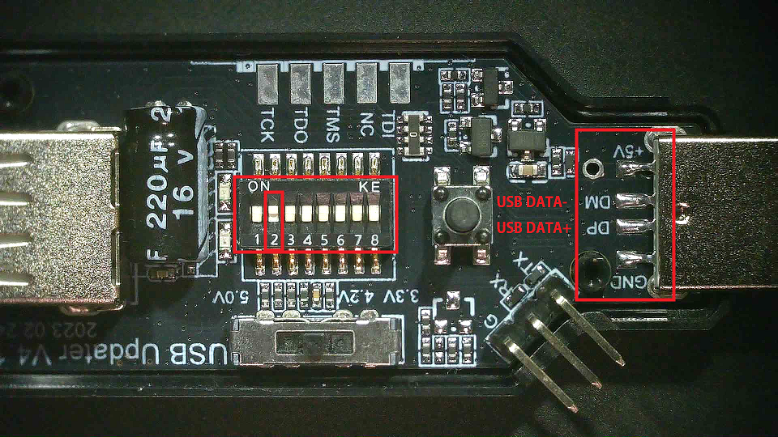
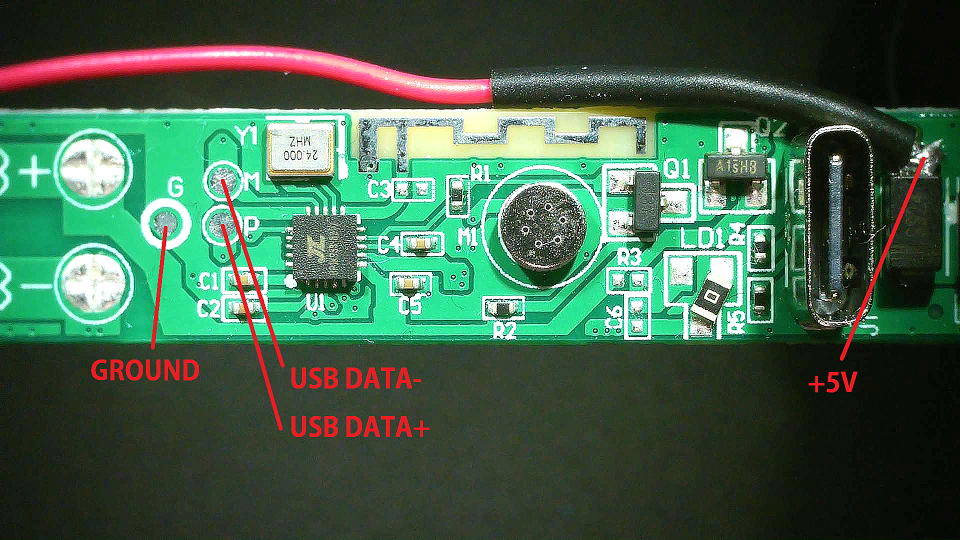
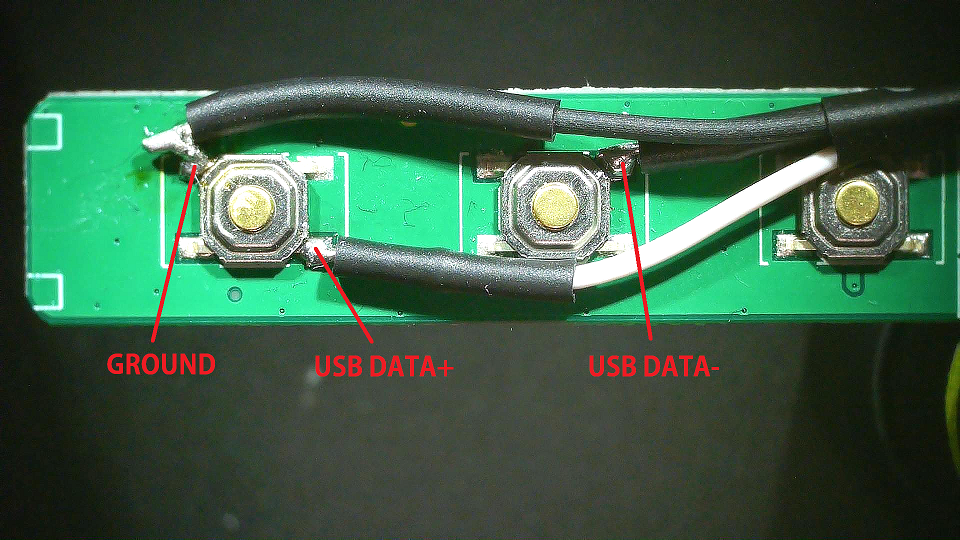

# Connecting the USB programmer and the device.

Link to the USB programmer: [JL USB Updater tool v4](https://www.aliexpress.com/item/1005009768042266.html)

- The programmer requires a USB type-A male-to-male cable!

There are also some references that JL devices can be programmed [without a programmer](https://github.com/kagaimiq/jielie/blob/main/isp/usb/usb-key.md)

## 1. Remove the built-in battery from the device by cutting the wires leading to it, or desolder them from the board.

- The programming tool needs to be able to restart the device. If the battery is not removed, the microcontroller stays on at all times.

## 2. Prepare the programming tool

- The programming tool has a plastic case that can be opened. Open the case, and set pin 2 to "on" position. All other pins should be off.

## 3. Connect the programming tool and the device

- GND to GND
- DATA+ to DATA+
- DATA- to DATA-
- +5V to +5V

On the device side, you can use the small debug ports, or connect to the buttons as shown below, as they share the same pins

## 4. Press the "Update" button on the programmer

- If the green LED shuts off and the red LED remains solid, the physical connection is made
